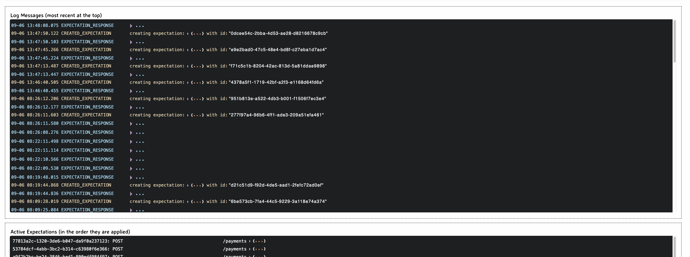

# Payment Gateway Application

This project is a Spring Boot application that implements a Payment Gateway. It communicates with a bank system using `RestTemplate` via MockServer, running on port 1080. The application includes Spring Security for authentication, and Spring Validation with a custom error-handling library to ensure robust input validation and error management.

# Requirements

The product requirements for this initial phase are the following:

- A merchant should be able to process a payment through the payment gateway and receive one of the following types of response:
  - **Authorized**: The payment was authorized by the call to the acquiring bank.
  - **Declined**: The payment was declined by the call to the acquiring bank.
  - **Rejected**: No payment could be created as invalid information was supplied to the payment gateway, and therefore, it has rejected the request without calling the acquiring bank.

- A merchant should be able to retrieve the details of a previously made payment.

# Processing a Payment

The payment gateway will need to provide merchants with a way to process a card payment. To do this, the merchant should be able to submit a request to the payment gateway. A payment request must include the following fields:

# Payment Information Validation Rules

The following table outlines the validation rules and additional notes for each field in the payment information:

| **Field**        | **Validation Rules**                                                                                 | **Notes**                                                                                                                                                     |
|------------------|------------------------------------------------------------------------------------------------------|---------------------------------------------------------------------------------------------------------------------------------------------------------------|
| **Card Number**  | - Required - Must be between 14-19 characters long - Must contain only numeric characters        |                                                                                                                                                               |
| **Expiry Month** | - Required - Value must be between 1-12                                                            |                                                                                                                                                               |
| **Expiry Year**  | - Required - Value must be in the future - Ensure the combination of expiry month + year is in the future |                                                                                                                                                               |
| **Currency**     | - Required - Must be 3 characters long - Ensure it validates against no more than 3 currency codes | Refer to the list of ISO currency codes.                                                                                                                    |
| **Amount**       | - Required - Must be an integer                                                                   | Represents the amount in the minor currency unit. For example: - $0.01 would be supplied as 1 - $10.50 would be supplied as 1050.                         |
| **CVV**          | - Required - Must be 3-4 characters long - Must contain only numeric characters                 |                                                                                                                                                               |

## Example

To illustrate these rules, here’s an example of a valid payment request:

> **_JSON:_**
{
"Id": "e8a6f4d3-8a0a-4b8e-9a65-5c5e9e3f7b8e",
"Status": "Authorized",
"LastFourCardDigits": "1234",
"ExpiryMonth": "12",
"ExpiryYear": "2025",
"Currency": "USD",
"Amount": 1050
}

# Payments API Response Specification

When a payment is sent to the acquiring bank, the response must include the following fields:

## Response Fields

| Field                    | Description                                                           | Format                                | Example                            |
|--------------------------|-----------------------------------------------------------------------|---------------------------------------|------------------------------------|
| **Id**                   | The payment ID used to retrieve payment details.                      | Unique identifier (e.g., GUID)        | `e8a6f4d3-8a0a-4b8e-9a65-5c5e9e3f7b8e` |
| **Status**               | Indicates the result of the payment attempt.                          | `Authorized` or `Declined`            | `Authorized`                        |
| **Last Four Card Digits**| The last four digits of the card used for the payment.                | Four-digit number                     | `1234`                              |
| **Expiry Month**         | The month the card expires.                                            | Two-digit number                      | `12`                                |
| **Expiry Year**          | The year the card expires.                                             | Four-digit number                     | `2025`                              |
| **Currency**             | The currency code for the payment.                                    | ISO 4217 currency code                | `USD`                               |
| **Amount**               | The payment amount in minor currency units.                           | Integer representing amount in smallest unit | `1050` (for USD $10.50)           |

## Example Response
> **_JSON:_**
{
  "Id": "e8a6f4d3-8a0a-4b8e-9a65-5c5e9e3f7b8e",
  "Status": "Authorized",
  "LastFourCardDigits": "1234",
  "ExpiryMonth": "12",
  "ExpiryYear": "2025",
  "Currency": "USD",
  "Amount": 1050
}

# Payment GateWay Diagram

# Payment GateWay Swagger Contract

# Bak Simulator using MockServer

# DEMO 
[Watch the video here](2024-09-07 16-14-08.mp4)

## Setup
> **Clone the repository**:
   git clone https://github.com/your-repo/payment-gateway.git
   cd payment-gateway
   docker-compose up
   mvn clean install